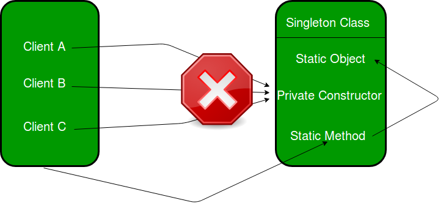

# 🌐 Singleton Design Pattern

The **Singleton** is a **creational design pattern** that ensures a class has **only one instance** and provides a **global access point** to that instance.



---

## 📌 Problem Addressed

The Singleton pattern tackles **two core issues**, albeit at the cost of violating the **Single Responsibility Principle**:

### 1. Ensure a class has only **one instance**

In scenarios involving **shared resources** (e.g., a database connection or configuration manager), creating multiple instances may lead to inconsistent behavior, wasted resources, or conflicts.

- With Singleton, any subsequent instantiation returns the same, previously created object.
- This is not possible with a regular constructor, which **always returns a new object**.


> ⚠️ Clients might not even be aware they're interacting with the same underlying object.

---

### 2. Provide a **global access point**

Singleton replaces risky **global variables** with a **controlled mechanism**:

- While global variables can be **overwritten** by accident, Singleton ensures that the instance is **encapsulated and safe**.
- Centralizes the object creation and access logic in one class.

---

## 💡 Real-World Analogy

> **The Government** of a country is a Singleton—there’s only one official government per nation, even if the members change over time. It's a globally accessible authority, and its existence is **singular and well-defined**.

---

## 🧩 Structure Overview


```plaintext
+----------------------+
|    Singleton Class   |
+----------------------+
| - instance           |  <-- Private static field
| - constructor()      |  <-- Private constructor
+----------------------+
| + getInstance()      |  <-- Static method returning the instance
| + businessLogic()    |  <-- Example methods using the instance
+----------------------+
```

---

## 🧪 Pseudocode Example

```java
// The Database class defines the `getInstance` method that lets
// clients access the same instance of a database connection
// throughout the program.
class Database is
    // The field for storing the singleton instance should be
    // declared static.
    private static field instance: Database

    // The singleton's constructor should always be private to
    // prevent direct construction calls with the `new`
    // operator.
    private constructor Database() is
        // Some initialization code, such as the actual
        // connection to a database server.
        // ...

    // The static method that controls access to the singleton
    // instance.
    public static method getInstance() is
        if (Database.instance == null) then
            acquireThreadLock() and then
                // Ensure that the instance hasn't yet been
                // initialized by another thread while this one
                // has been waiting for the lock's release.
                if (Database.instance == null) then
                    Database.instance = new Database()
        return Database.instance

    // Finally, any singleton should define some business logic
    // which can be executed on its instance.
    public method query(sql) is
        // For instance, all database queries of an app go
        // through this method. Therefore, you can place
        // throttling or caching logic here.
        // ...
```

**Usage:**

```java
class Application is
    method main() is
        Database foo = Database.getInstance()
        foo.query("SELECT ...")
        // ...
        Database bar = Database.getInstance()
        bar.query("SELECT ...")
        // The variable `bar` will contain the same object as
        // the variable `foo`.
```

---

## ✅ Applicability

Use the Singleton pattern when:

- A class should **only have one instance** available across the entire system.
- You need **centralized management** of a shared resource (e.g., config, logger, or connection pool).
- You want **controlled global access** that is thread-safe and encapsulated.

---

## 🛠 How to Implement

1. Declare a **private static instance** field in the class.
2. Make the **constructor private** to prevent instantiation from outside.
3. Implement a **public static method** (`getInstance()`) to:

   - Lazily initialize the instance.
   - Always return the same object.

4. Replace direct constructor calls with the `getInstance()` method in client code.

---

## 📈 Pros & Cons

| ✅ Pros                                                             | ⚠️ Cons                                                                                                                                |
| ------------------------------------------------------------------- | -------------------------------------------------------------------------------------------------------------------------------------- |
| Guarantees a **single instance** of a class                         | **Violates SRP**: Manages both instance control and core business logic                                                                |
| Provides a **global access point**                                  | Can **hide bad design** and increase coupling between classes                                                                          |
| Supports **lazy initialization**                                    | Requires extra work for **thread safety** in multithreaded environments                                                                |
| Can improve performance with **shared caching or throttling** logic | Can be **hard to test** and mock due to private constructor and static access (use dependency injection or interfaces as alternatives) |

---

## 🔗 Relations to Other Patterns

- **Facade**: Often implemented as Singleton since a single interface is usually sufficient.
- **Flyweight** vs Singleton:

  - Singleton = **1 instance**
  - Flyweight = **many immutable shared instances**

- **Abstract Factory**, **Builder**, and **Prototype**: Can be implemented as Singleton when a single instance is enough.

---

## 🎯 Summary

The **Singleton Pattern** is ideal when:

- You require **a single point of coordination** across your system.
- You want to avoid the pitfalls of **uncontrolled global variables**.
- You need **controlled instantiation** with the potential for **lazy loading** and **thread safety**.

> Use with care—while powerful, Singleton can lead to tightly coupled, less testable code if overused.

---

Would you like a visual UML class diagram, implementation in a specific language, or usage examples in a real project (like your mail tracking system or online library system)?
