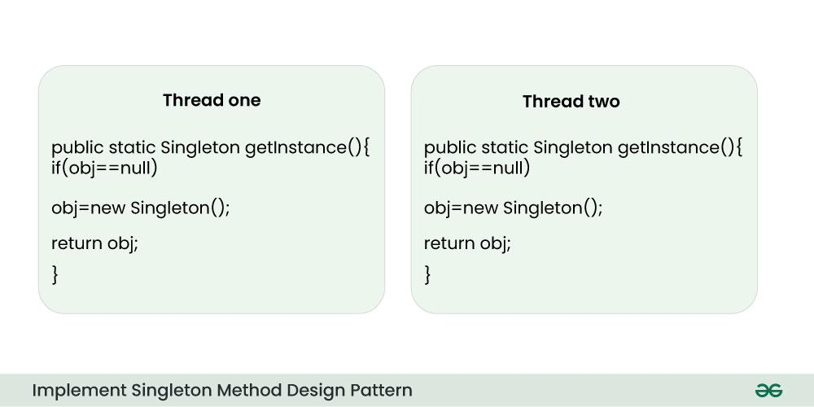

# 🎯 Singleton Method Design Pattern

> **The Singleton Method Design Pattern** ensures a class has only one instance and provides a global access point to it. It’s ideal for scenarios requiring centralized control, such as managing database connections or configuration settings.This article explores its **principles**, **benefits**, **drawbacks**, and **best use cases** in software development.

---

## 📚 Table of Contents

1. [🧩 What is the Singleton Method Design Pattern?](#1--what-is-the-singleton-method-design-pattern)
2. [🕒 When to Use Singleton Method Design Pattern?](#2--when-to-use-singleton-method-design-pattern)
3. [⚡ Initialization Types of Singleton](#3-initialization-types-of-singleton)
4. [🔑 Key Components of the Singleton Method Design Pattern](#4-key-component-of-singleton-method-design-pattern)
5. [💻 Implementation of the Singleton Method Design Pattern](#5-implementation-of-the-singleton-method-design-pattern)
6. [🛠️ Different Ways to Implement the Singleton Method Design Pattern](#6-different-ways-to-implement-the-singleton-method-design-pattern)
7. [🚀 Use Cases for the Singleton Design Pattern](#7-use-cases-for-the-singleton-design-pattern)
8. [✅ Advantages of the Singleton Design Pattern](#8-advantages-of-the-singleton-design-pattern)
9. [⚠️ Disadvantages of the Singleton Design Pattern](#9-disadvantages-of-the-singleton-design-pattern)

---

## 1. 🧩 What is the Singleton Method Design Pattern?

> The **Singleton** method or Singleton Design pattern is one of the simplest design patterns.  
> It ensures a class only has **one instance**, and provides a **global point of access** to it.

<p align="center">
    
</p>

### 🔑 Singleton Design Pattern Principles

- **Single Instance:**  
   Ensures that only one instance of the class exists throughout the application.

- **Global Access:**  
   Provides a global point of access to that instance.  
   Supports lazy or eager initialization.

- **Thread Safety:**  
   Implements mechanisms to prevent multiple threads from creating separate instances simultaneously.

- **Private Constructor:**  
   Restricts direct instantiation by making the constructor private, forcing the use of the access point.

---

## 2. 🕒 When to Use Singleton Method Design Pattern?

Use the Singleton Method Design Pattern when:

- You need to ensure that only one instance of a class exists in your application.
- You want to provide a straightforward way for clients to access that instance from a specific location in your code.
- You might want to extend the class later; the Singleton pattern allows for subclassing.
- Common use cases: logging, managing connections to hardware or databases, caching data, or handling thread pools.

---

## 3. ⚡ Initialization Types of Singleton

Singleton class can be instantiated by two methods:

- **Early Initialization:**  
   The class is initialized whether it is to be used or not.  
   _Advantage:_ Simplicity.  
   _Drawback:_ Always initialized, even if not used.

- **Lazy Initialization:**  
   The class is initialized only when required.  
   _Advantage:_ Saves resources if the instance is never needed.  
   _Commonly used in Singleton classes._

---

## 4. 🔑 Key Component of Singleton Method Design Pattern

Below are the main key components of Singleton Method Design Pattern:

<p align="center">
    
</p>

### 1️⃣ Static Member

```java
// Static member to hold the single instance
private static Singleton instance;
```

### 2️⃣ Private Constructor

```java
// Private constructor to prevent external instantiation
class Singleton {
        private Singleton() {
                // Initialization code here
        }
}
```

### 3️⃣ Static Factory Method

```java
// Static factory method for global access
public static Singleton getInstance() {
        if (instance == null) {
                instance = new Singleton();
        }
        return instance;
}
```

---

## 5. 💻 Implementation of Singleton Method Design Pattern

The implementation of a Singleton Design Pattern is described in the following class diagram:

<p align="center">
    
</p>

The implementation is very simple and consists of a single class.  
To ensure uniqueness, all constructors should be private.  
Global access is done through a static method.

```java
/*package whatever //do not write package name here */
import java.io.*;
class Singleton {
        // static class
        private static Singleton instance;

        private Singleton(){
                System.out.println("Singleton is Instantiated.");
        }

        public static Singleton getInstance(){
                if (instance == null)
                        instance = new Singleton();
                return instance;
        }

        public static void doSomething(){
                System.out.println("Somethong is Done.");
        }
}

class GFG {
        public static void main(String[] args){
                Singleton.getInstance().doSomething();
        }
}
```

**Output:**

```
Singleton is Instantiated.
Somethong is Done.
```

The `getInstance` method checks whether the instance is null.  
If not, it returns the existing object; otherwise, it creates it.

---

## 6. 🛠️ Different Ways to Implement Singleton Method Design Pattern

Sometimes we need only one instance of a class (e.g., a single DB connection shared by multiple objects).

<p align="center">
    
</p>

Let’s see various design options:

### 🔹 Method 1 - Classic Implementation

```java
// Classical Java implementation of singleton design pattern
class Singleton {
        private static Singleton obj;

        // private constructor to force use of getInstance()
        private Singleton() {}

        public static Singleton getInstance() {
                if (obj == null)
                        obj = new Singleton();
                return obj;
        }
}
```

> **Note:** Not thread-safe.

---

### 🔹 Method 2 - Synchronized getInstance()

```java
// Thread Synchronized Java implementation
class Singleton {
        private static Singleton obj;
        private Singleton() {}

        // Only one thread can execute this at a time
        public static synchronized Singleton getInstance() {
                if (obj == null)
                        obj = new Singleton();
                return obj;
        }
}
```

> **Note:** Thread-safe, but may decrease performance.

---

### 🔹 Method 3 - Eager Instantiation

```java
// Static initializer based Java implementation
class Singleton {
        private static Singleton obj = new Singleton();
        private Singleton() {}

        public static Singleton getInstance() { return obj; }
}
```

> **Note:** Thread-safe. Use when singleton is lightweight and always needed.

---

### 🔹 Method 4 - Double Checked Locking (Most Efficient)

```java
// Double Checked Locking based Java implementation
class Singleton {
        private static volatile Singleton obj = null;
        private Singleton() {}

        public static Singleton getInstance() {
                if (obj == null) {
                        synchronized (Singleton.class) {
                                if (obj == null)
                                        obj = new Singleton();
                        }
                }
                return obj;
        }
}
```

> **Note:** Reduces overhead of synchronized method.

---

### 🔹 Method 5 - Inner Class (Java Specific)

```java
// Using class loading concept
public class Singleton {

        private Singleton() {
                System.out.println("Instance created");
        }

        private static class SingletonInner {
                private static final Singleton INSTANCE = new Singleton();
        }
        public static Singleton getInstance() {
                return SingletonInner.INSTANCE;
        }
}
```

> **Note:** Inner class loaded only when needed. Thread-safe and efficient.

---

## 7. 🚀 Use Cases for the Singleton Design Pattern

- Managing database connections (resource-heavy).
- Global settings/configuration manager.
- Centralized control of UI components.
- Organizing print jobs in document printing systems.

---

## 8. ✅ Advantages of the Singleton Design Pattern

- Guarantees only one instance with a unique identifier.
- Supports both eager and lazy initialization.
- Can be thread-safe if implemented correctly.
- Helps lower memory usage in resource-limited applications.

---

## 9. ⚠️ Disadvantages of the Singleton Design Pattern

- Can make unit testing difficult due to global state.
- Risk of race conditions in multi-threaded environments.
- Refactoring to allow multiple instances can be challenging.
- Creates global dependency, complicating dependency injection.
- Subclassing can be tricky due to private constructor.
