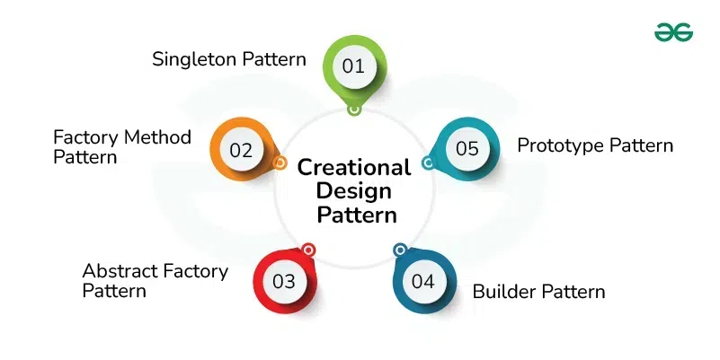

# Introduction to Creational Design Patterns

Creational design patterns are a category of design patterns in object-oriented programming that deal with object creation mechanisms. They abstract the instantiation process, making it more flexible and dynamic. By using creational patterns, you can control how objects are created, reduce dependencies, and improve code maintainability.

Common creational design patterns include:

- **Singleton**
- **Factory Method**
- **Abstract Factory**
- **Builder**
- **Prototype**

## Benefits of Creational Design Patterns

Creational design patterns offer several key benefits:

- They allow for greater flexibility in object creation. By decoupling the process of instantiation from the rest of the system, you can easily change the class being instantiated without affecting other components.

- These patterns encapsulate the logic of object creation, which simplifies code management and promotes cleaner, more organized code.

- By centralizing the creation logic, these patterns promote reusability. You can use the same creation methods across different parts of the application.

- They help manage complex object creation processes, making it easier to handle configurations and dependencies, especially when dealing with many related classes.
