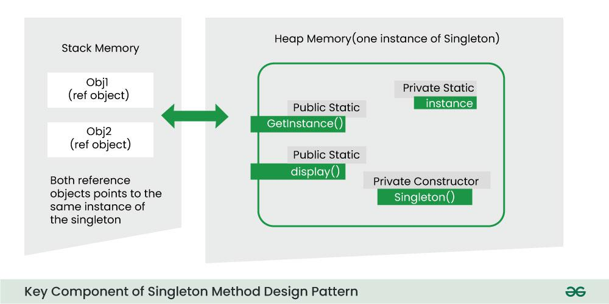

<style>
/* Add some color and style for headings, tables, and code blocks */
h1, h2, h3, h4 {
    color: #2d7ff9;
    border-bottom: 1px solid #e0e0e0;
    padding-bottom: 4px;
}
blockquote {
    background: #f0f7ff;
    border-left: 5px solid #2d7ff9;
    padding: 10px 20px;
    color: #333;
    font-style: italic;
}
hr {
    border: 0;
    height: 1px;
    background: linear-gradient(to right, #2d7ff9, #fff);
    margin: 24px 0;
}
ul, ol {
    margin-left: 1.5em;
}
code, pre {
    background: #f6f8fa;
    color: #2d7ff9;
    border-radius: 4px;
    padding: 2px 6px;
}
pre {
    border: 1px solid #e0e0e0;
    padding: 12px;
    overflow-x: auto;
}
img {
    border: 2px solid #2d7ff9;
    border-radius: 8px;
    margin: 12px 0;
    max-width: 100%;
}
.table-of-contents {
    background: #eaf4ff;
    border: 1px solid #b3d8fd;
    border-radius: 8px;
    padding: 16px;
    margin-bottom: 24px;
}
.section-title {
    background: linear-gradient(90deg, #2d7ff9 0%, #b3d8fd 100%);
    color: #fff;
    padding: 8px 16px;
    border-radius: 6px;
    margin-bottom: 12px;
    display: inline-block;
}
.advantage, .disadvantage {
    display: flex;
    align-items: center;
    margin-bottom: 8px;
}
.advantage::before {
    content: "✅";
    margin-right: 8px;
    color: #2ecc40;
}
.disadvantage::before {
    content: "⚠️";
    margin-right: 8px;
    color: #ff4136;
}
</style>

# Singleton Method Design Pattern

> **The Singleton Method Design Pattern** ensures a class has only one instance and provides a global access point to it. It’s ideal for scenarios requiring centralized control, such as managing database connections or configuration settings. This article explores its principles, benefits, drawbacks, and best use cases in software development.

---

<div class="table-of-contents">

## 📚 Table of Contents

1. [What is the Singleton Method Design Pattern?](#1--what-is-the-singleton-method-design-pattern)
2. [When to Use Singleton Method Design Pattern?](#2--when-to-use-singleton-method-design-pattern)
3. [Initialization Types of Singleton](#3-initialization-types-of-singleton)
4. [Key Components of the Singleton Method Design Pattern](#4-key-component-of-singleton-method-design-pattern)
5. [Implementation of the Singleton Method Design Pattern](#5-implementation-of-the-singleton-method-design-pattern)
6. [Different Ways to Implement the Singleton Method Design Pattern](#6-different-ways-to-implement-the-singleton-method-design-pattern)
7. [Use Cases for the Singleton Design Pattern](#7-use-cases-for-the-singleton-design-pattern)
8. [Advantages of the Singleton Design Pattern](#8-advantages-of-the-singleton-design-pattern)
9. [Disadvantages of the Singleton Design Pattern](#9-disadvantages-of-the-singleton-design-pattern)

</div>

---

<div class="section-title">1. 🧩 What is the Singleton Method Design Pattern?</div>

> The Singleton method or Singleton Design pattern is one of the simplest design patterns.  
> It ensures a class only has one instance, and provides a global point of access to it.


### 🔑 Singleton Design Pattern Principles

**Principles of the Singleton Pattern:**

- **Single Instance:**  
     Ensures that only one instance of the class exists throughout the application.

- **Global Access:**  
     Provides a global point of access to that instance.  
     Supports lazy or eager initialization (creating the instance when needed or when the class is loaded).

- **Thread Safety:**  
     Implements mechanisms to prevent multiple threads from creating separate instances simultaneously.

- **Private Constructor:**  
     Restricts direct instantiation by making the constructor private, forcing the use of the access point.

---

<div class="section-title">2. 🕒 When to Use Singleton Method Design Pattern?</div>

Use the Singleton Method Design Pattern when:

- You need to ensure that only one instance of a class exists in your application.

- You want to provide a straightforward way for clients to access that instance from a specific location in your code.

- You might want to extend the class later; the Singleton pattern allows for subclassing, so clients can work with the extended version without changing the original Singleton.

- This pattern is often used in situations like logging, managing connections to hardware or databases, caching data, or handling thread pools, where having just one instance makes sense.

---

<div class="section-title">3. Initialization Types of Singleton</div>

Singleton class can be instantiated by two methods:

- **Early initialization :**
    In this method, class is initialized whether it is to be used or not. The main advantage of this method is its simplicity. You initiate the class at the time of class loading. Its drawback is that class is always initialized whether it is being used or not.

- **Lazy initialization :**
    In this method, class in initialized only when it is required. It can save you from instantiating the class when you don't need it. Generally, lazy initialization is used when we create a singleton class.

---

<div class="section-title">4. Key Component of Singleton Method Design Pattern</div>

Below are the main key components of Singleton Method Design Pattern:



#### 1. Static Member:

```java
// Static member to hold the single instance
private static Singleton instance;
```

#### 2. Private Constructor:

```java
// Private constructor to
// prevent external instantiation
class Singleton {

        // Making the constructor as Private
        private Singleton()
        {
                // Initialization code here
        }
}
```

#### 3. Static Factory Method:

```java
// Static factory method for global access
public static Singleton getInstance()
{
        // Check if an instance exists
        if (instance == null) {
                // If no instance exists, create one
                instance = new Singleton();
        }
        // Return the existing instance
        return instance;
}
```

---

<div class="section-title">5. Implementation of Singleton Method Design Pattern</div>

The implementation of a Singleton Design Pattern or Pattern Singleton is described in the following class diagram:


```java
/*package whatever //do not write package name here */
import java.io.*;
class Singleton {
        // static class
        private static Singleton instance;

        private Singleton(){
                System.out.println("Singleton is Instantiated.");
        }

        public static Singleton getInstance(){
                if (instance == null)
                        instance = new Singleton();
                return instance;
        }

        public static void doSomething(){
                System.out.println("Somethong is Done.");
        }
}

class GFG {
        public static void main(String[] args){
                Singleton.getInstance().doSomething();
        }
}
```

**Output**

> Singleton is Instantiated.  
> Somethong is Done.

---

<div class="section-title">6. Different Ways to Implement Singleton Method Design Pattern</div>

Sometimes we need to have only one instance of our class for example a single DB connection shared by multiple objects as creating a separate DB connection for every object may be costly. Similarly, there can be a single configuration manager or error manager in an application that handles all problems instead of creating multiple managers.


#### Method 1 - Classic Implementation

```java
// Classical Java implementation of singleton
// design pattern
class Singleton {
        private static Singleton obj;

        // private constructor to force use of
        // getInstance() to create Singleton object
        private Singleton() {}

        public static Singleton getInstance()
        {
                if (obj == null)
                        obj = new Singleton();
                return obj;
        }
}
```

> **_Note_**: Singleton obj is not created until we need it and call the getInstance() method. This is called lazy instantiation. The main problem with the above method is that it is not thread-safe.

#### Method 2 - Synchronized getInstance()

```java
// Thread Synchronized Java implementation of
// singleton design pattern
class Singleton {
        private static Singleton obj;
        private Singleton() {}

        // Only one thread can execute this at a time
        public static synchronized Singleton getInstance()
        {
                if (obj == null)
                        obj = new Singleton();
                return obj;
        }
}
```

#### Method 3 - Eager Instantiation

```java
// Static initializer based Java implementation of
// singleton design pattern
class Singleton {
        private static Singleton obj = new Singleton();
        private Singleton() {}

        public static Singleton getInstance() { return obj; }
}
```

#### Method 4 - Double Checked Locking

```java
// Double Checked Locking based Java implementation of
// singleton design pattern
class Singleton {
        private static volatile Singleton obj = null;
        private Singleton() {}

        public static Singleton getInstance()
        {
                if (obj == null) {
                        // To make thread safe
                        synchronized (Singleton.class)
                        {
                                // check again as multiple threads
                                // can reach above step
                                if (obj == null)
                                        obj = new Singleton();
                        }
                }
                return obj;
        }
}
```

#### Method 5 - Instantiation through Inner Class

```java
//using class loading concept
// singleton design pattern

public class Singleton {

        private Singleton() {
        System.out.println("Instance created");
        }

        private static class SingletonInner{

        private static final Singleton INSTANCE=new Singleton();
        }
        public static Singleton getInstance()
        {
        return SingletonInner.INSTANCE;
        }
}
```

---

<div class="section-title">7. Use Cases for the Singleton Design Pattern</div>

- In applications where creating and managing database connections is resource-heavy, using a Singleton ensures that there’s just one connection maintained throughout the application.

- When global settings need to be accessed by different parts of the application, a Singleton configuration manager provides a single point of access for these settings.

- Singleton helps to centralize control and making it easier to manage the state and actions of user interface components.

- Singleton can effectively organize print jobs and streamlines the process in the systems where document printing is required.

---

<div class="section-title">8. Advantages of the Singleton Design Pattern</div>

<div class="advantage">The Singleton pattern guarantees that there’s only one instance with a unique identifier, which helps prevent naming issues.</div>
<div class="advantage">This pattern supports both eager initialization (creating the instance when the class is loaded) and lazy initialization (creating it when it’s first needed), providing adaptability based on the use case.</div>
<div class="advantage">When implemented correctly, a Singleton can be thread-safe, ensuring that multiple threads don’t accidentally create duplicate instances.</div>
<div class="advantage">By keeping just one instance, the Singleton pattern can help lower memory usage in applications where resources are limited.</div>

---

<div class="section-title">9. Disadvantages of the Singleton Design Pattern</div>

<div class="disadvantage">Singletons can make unit testing difficult since they introduce a global state. This can complicate testing components that depend on a Singleton, as its state can influence the test results.</div>
<div class="disadvantage">In multi-threaded environments, the process of creating and initializing a Singleton can lead to race conditions if multiple threads try to create it simultaneously.</div>
<div class="disadvantage">If you later find that you need multiple instances or want to modify how instances are created, it can require significant code changes.</div>
<div class="disadvantage">The Singleton pattern creates a global dependency, which can complicate replacing the Singleton with a different implementation or using dependency injection.</div>
<div class="disadvantage">Subclassing a Singleton can be tricky since the constructor is usually private. This requires careful handling and may not fit standard inheritance practices.</div>
